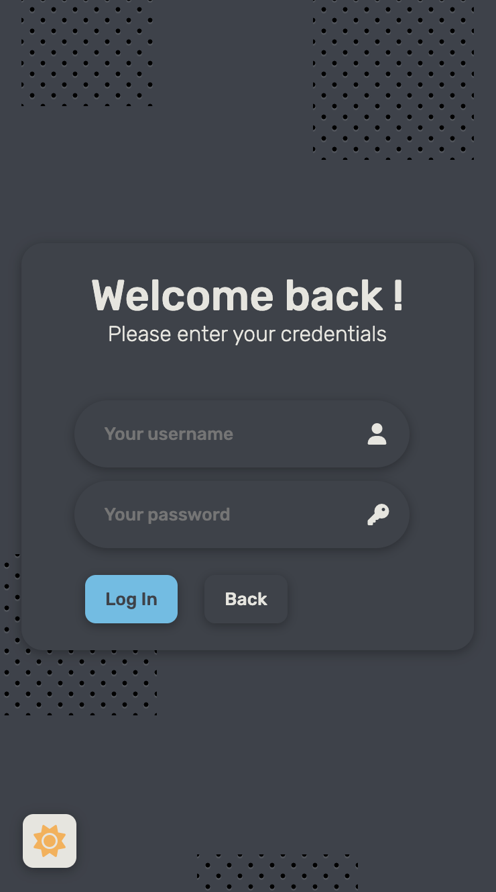
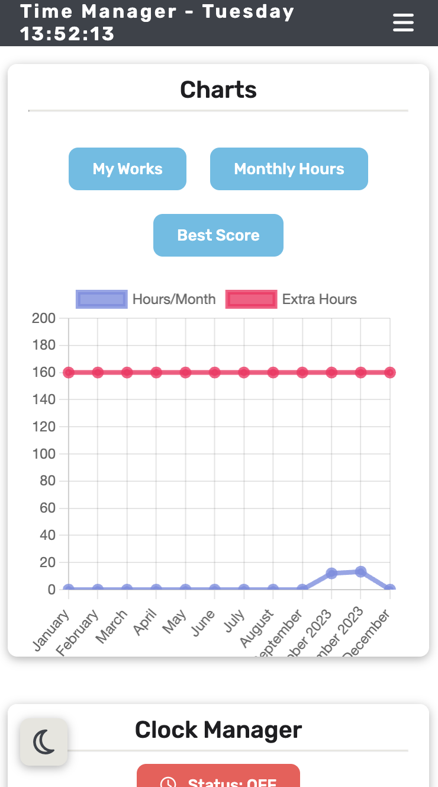
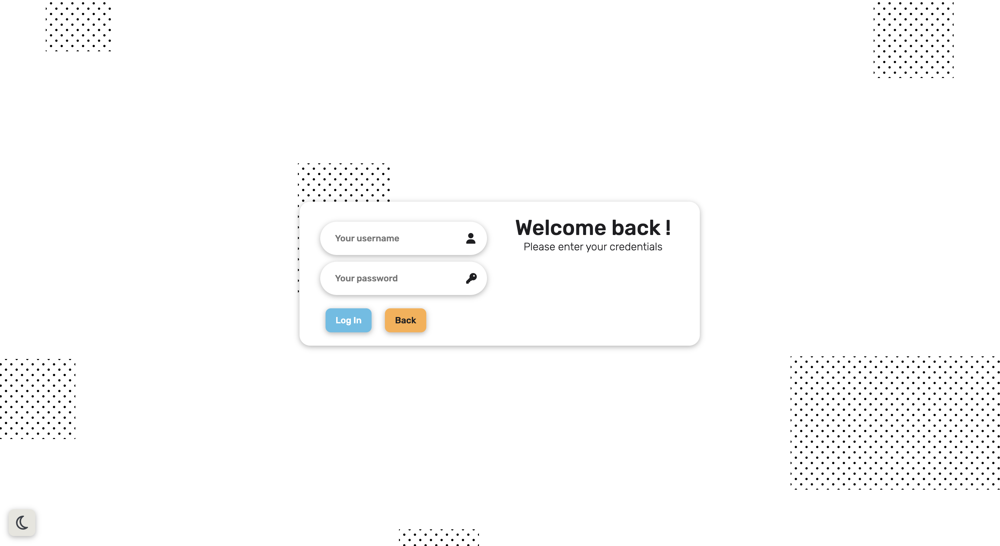
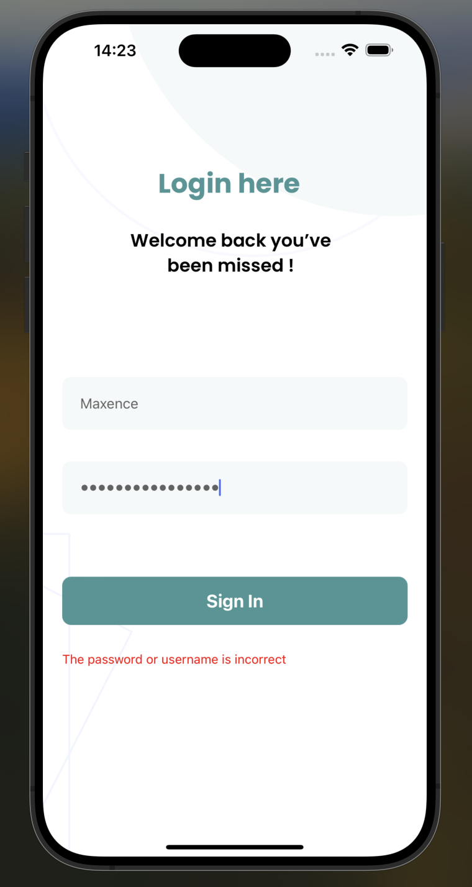

# Time Manager ⏰
A "Time Manager" website is a digital platform designed to help individuals and organizations effectively manage their time and tasks. It offers a range of tools, features, and resources to enhance productivity, streamline daily activities, and prioritize tasks. These websites are particularly useful for people seeking to achieve better time management, organization, and efficiency in their personal and professional lives.

In this repository you have :  

**front folder** its our web interface made with ReactJs  
**projetZ folder** its our backend made with elixir & Pheonix  
**mobile-app folder** its our mobile application made with React Native
# Some previews

  
Web - Mobile (click me) 📱

  
  

  
Web - Desktop (click me) 💻

  

  
Mobile Application (click me) 👾

# Quick Start
<ins>Requirements</ins>  
- Docker Desktop
- NodeJs

<ins>How to start ?</ins>

- Web application
  -  Go to the root of the project
  -  Do in a terminal : **docker compose up -d**
  - That's all !
 
- Mobile App
  -  First you need to start the backend container, follow the steps from "Web application"
  -  Go to the root of mobile-app
  -  Do in a terminal **npm i** and **npm start**
  -  That's all !

# Techno and Tools

# TEAM
🔵 [Maxence BONNICI](https://github.com/ImMaxence)  
🔴 [Nacer FATEH](https://github.com/Azkela)  
🟢 [Anissa MOKRANI]()  
🟣 [Pierre BEJIAN]()  
🟡 [Morgan MORHAIN]()  
